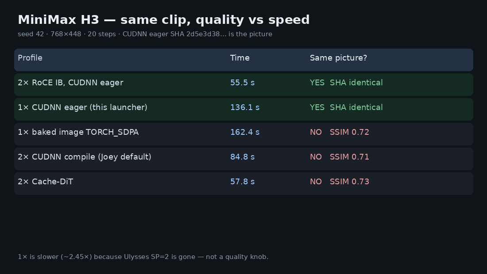

# MiniMax H3 on one DGX Spark (quality profile)

Same picture as the two-Spark quality clip. One GPU. Slower.

## At a glance

| | |
|---|---|
| **What it is** | MiniMax H3 FL2VA on **one** DGX Spark, CUDNN **eager**, **no Cache-DiT** |
| **What it’s for** | Pair H3 with a TP1 chat model on the other Spark without dropping video quality |
| **How to use it** | `git clone … && cd MiniMax-H3-1x-DGX-Spark && ./setup.sh && ./start.sh` |



## Try it

```bash
git clone https://github.com/Coinupbtc/MiniMax-H3-1x-DGX-Spark.git
cd MiniMax-H3-1x-DGX-Spark
./setup.sh
./start.sh          # this Spark, :8800
./start.sh n2       # other Spark
./stop.sh
```

Needs Joey’s one-Spark recipe checked out next to this repo (`../MiniMax-H3-DGX-Spark`), the `sm121-fp8` image, and FL2VA weights. `setup.sh` checks those. Do not start this while two-Spark H3 still owns both GPUs.

**Proved 2026-09-05:** same seed-42 clip on one Spark, SHA `2d5e3d38…` **identical** to the two-Spark IB quality file (SSIM 1.0). Warm client **136 s** vs 55.5 s on two Sparks. Full table: [docs/quality-speed.md](docs/quality-speed.md) (also on the [2× repo](https://github.com/Coinupbtc/MiniMax-H3-2x-DGX-Spark/blob/main/docs/quality-speed.md)).

This repository is a launcher. The image, patch, and compose file live in [Joey Rodriguez’s one-Spark recipe](https://github.com/joeynyc/MiniMax-H3-DGX-Spark). The quality law comes from the [two-Spark GB10 RoCE fork](https://github.com/Coinupbtc/MiniMax-H3-2x-DGX-Spark).

> MiniMax H3 weights and outputs are **not** Apache-2.0. Read Joey’s `MODEL-LICENSE.md` before serving. This repository contains no model weights and no generated media.

Joey’s stock compose default is **compile**. The published `sm121-fp8` image also **hardcodes `TORCH_SDPA`**, which ignores quality env and is a different picture (SSIM 0.72). This wrapper mounts Joey’s host `start-fp8.sh` and forces **CUDNN eager + no cache**.

## Credit

- One-Spark compatibility image and compose: [Joey Rodriguez / joeynyc](https://github.com/joeynyc/MiniMax-H3-DGX-Spark)
- Quality profile (eager, no Cache-DiT) and RoCE proof: [Coinupbtc/MiniMax-H3-2x-DGX-Spark](https://github.com/Coinupbtc/MiniMax-H3-2x-DGX-Spark)
